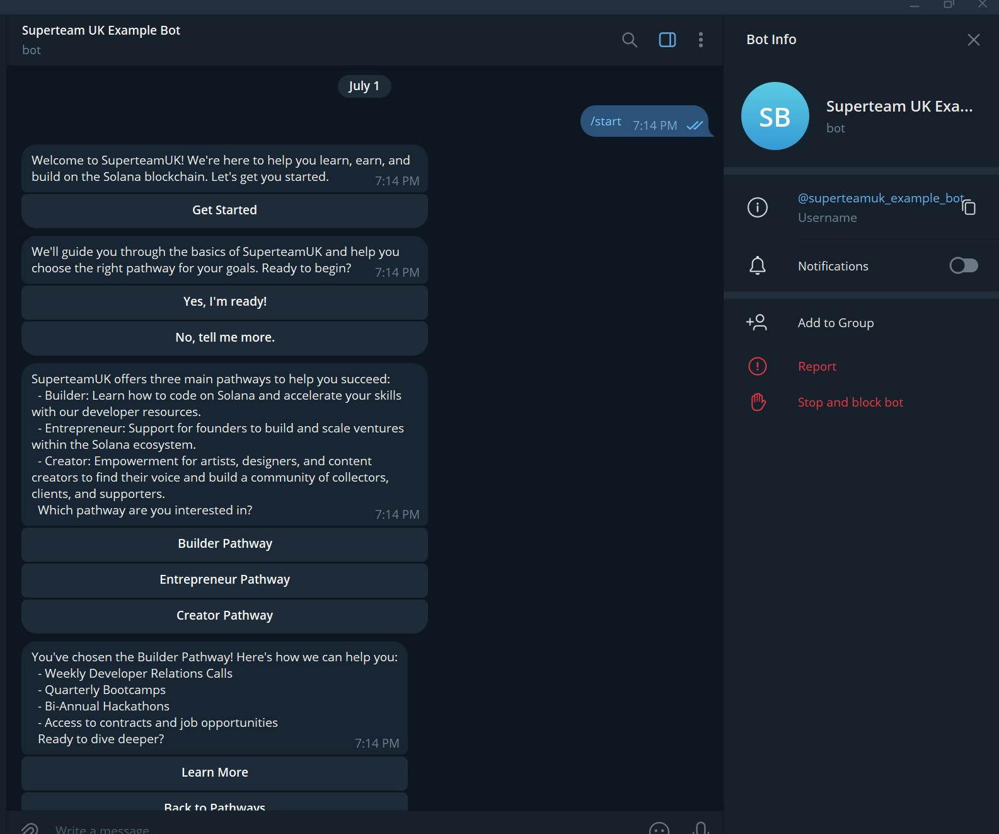
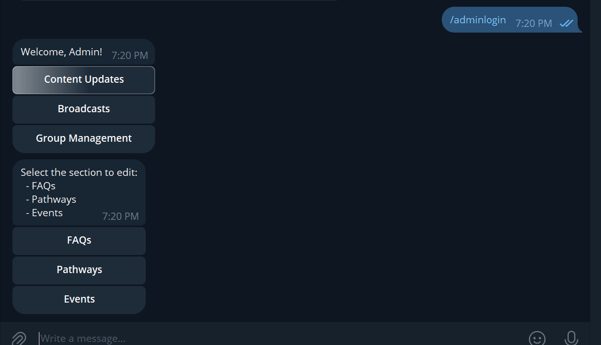

# SuperteamUK Example Telegram Bot

This is a minimal version of the SuperteamUK bot to showcase its basic functionality. The bot is written in JavaScript and uses the `node-telegram-bot-api` library to interact with the Telegram API. It also uses Node.js and Express.js to create a server.

## Features

- **User Interaction**: Provides orientation for new users, guiding them through different pathways (Builder, Entrepreneur, Creator).
- **Admin Panel**: Showcases admin integration for content updates, broadcasts, and group management. Admins can log in and manage the bot through a custom menu.
- **Group Compatibility**: The bot is compatible with both individual and group chats.

## Admin Panel

To showcase admin integration, the bot includes features for content updates, broadcasts, and group management. This can be updated to use preferred APIs and responses.

## Usage

### Commands

- **/start**: Initiates the bot and sends a welcome message.
- **/adminlogin**: Allows admin users to access the admin panel.
- **/getid**: Returns the user's Telegram ID. (For debugging purposes)

### Admin Panel Commands (Demo only)

- **Content Updates**: Edit FAQs, pathways, and events. 
- **Broadcasts**: Send broadcast messages to users.
- **Group Management**: Create and manage groups.

## Customization

- Update the welcome messages and pathways in the code to fit your specific needs.
- Customize admin functionality by modifying the admin panel commands and responses.

### Note

This bot is a simplified example and may require further development to handle specific use cases and edge cases in production environments.